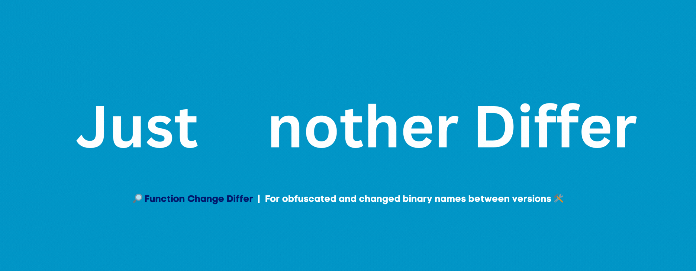

<p align="center">
    
  </a>
</p>
<p align="center"> 🔎 A diffing tool for binary files when comparing obfuscated and changed binary names between versions 🛠️ </b> </p>

<div align="center">


<br>
[](https://ko-fi.com/P5P7C2MM6)

</div>

Just Another Differ (JAD) is a command-line tool for comparing two binary files. It uses fuzzy string matching and Ghidra's decompilation to analyze function similarities between binaries. A great example of using JAD is when reviewing a newer version of a binary that has stripped or obfuscated function names compared to an older version which does not - JAD will produce a map of the functions in the new binary that are the closest in similarity to the old binary.

* **🔬 Function Finding:** JAD will produce an output map of function similarities between two binaries.
* * **🌐 Outputs:** JAD can produce a text, HTML, or stdout output for the mapping it produces.
* **🛠️ Ghidra Enabled:** JAD uses Ghidra headless to enable decompilation of functions!

# ⚙️ Setup

## Dependancies

JAD requires [Ghidra](https://ghidra-sre.org/) to be installed, and for ```analyzeHeadless``` to be on your path. If
it is not on your path Tweezer will request on run where the binary is located. To install all other dependencies use
the ```requirements.txt``` file, with:

```
pip install -r requirements.txt
```

## Running
JAD 

# 🙏 Contributions

JAD is an open-source project and welcomes contributions from the community. If you would like to contribute to
JAD, please follow these guidelines:

- Fork the repository to your own GitHub account.
- Create a new branch with a descriptive name for your contribution.
- Make your changes and test them thoroughly.
- Submit a pull request to the main repository, including a detailed description of your changes and any relevant
  documentation.
- Wait for feedback from the maintainers and address any comments or suggestions (if any).
- Once your changes have been reviewed and approved, they will be merged into the main repository.

# ⚖️ Code of Conduct

JAD follows the Contributor Covenant Code of Conduct. Please make
sure [to review](https://www.contributor-covenant.org/version/2/1/code_of_conduct/code_of_conduct.md). and adhere to
this code of conduct when contributing to JAD.

# 🐛 Bug Reports and Feature Requests

If you encounter a bug or have a suggestion for a new feature, please open an issue in the GitHub repository. Please
provide as much detail as possible, including steps to reproduce the issue or a clear description of the proposed
feature. Your feedback is valuable and will help improve JAD for everyone.

# 📜 License

[GNU General Public License v3.0](https://choosealicense.com/licenses/gpl-3.0/)
